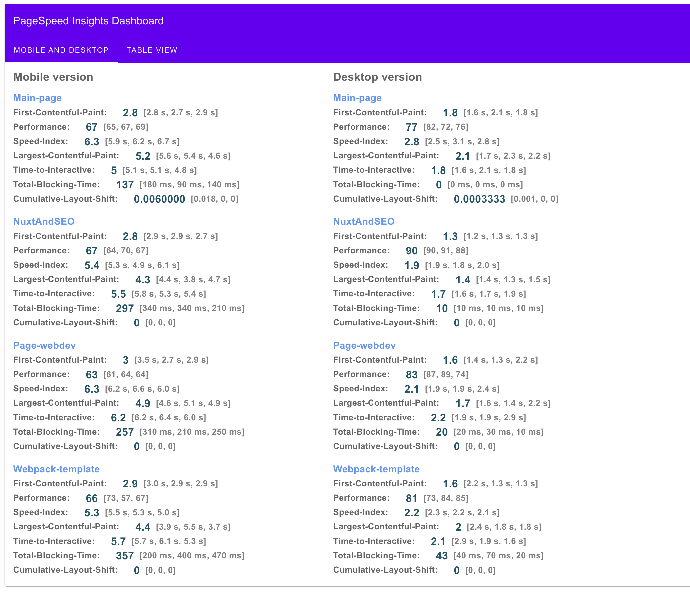
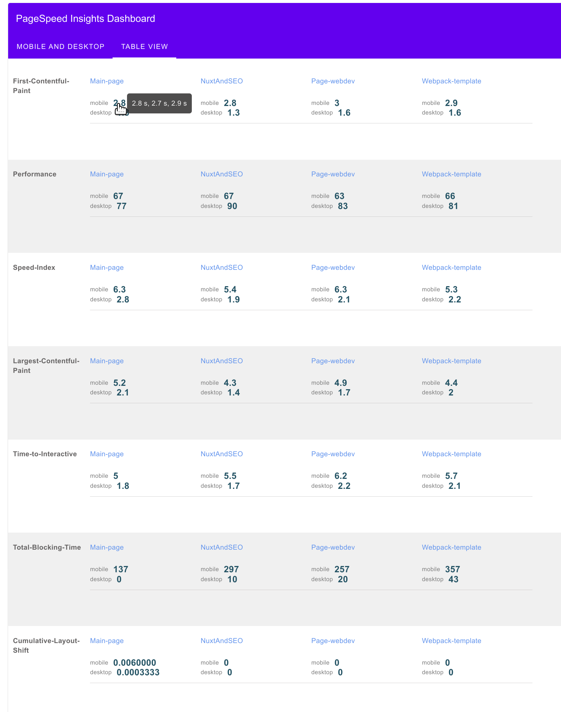
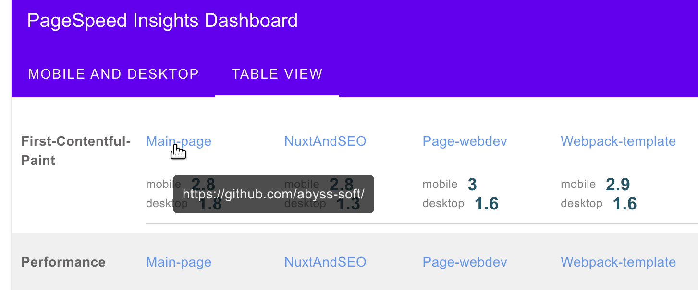

# Lighthouse-testing

> Automation of site testing in lighthouse
> 
> A dashboard of all measurements can be viewed here **/view/index.html** (two views, each showing the mean and measurements for each test), example 








### Install

> npm install

###  Run
for asynchronous testing (everything is done at the same time):
> npm run testing
> 
for sequential testing (everything is performed sequentially, one after the other. Suitable for slow computers):
> npm run testingSync
>
### View dashboards for all statistics

> view/index.html

### Page setup and number of measurements per page

In the **url.js** file, you need to create links to the pages of your site that need to be tested.

Variable **countTesting = 3**  in file start.js shows how many times to measure each link.

All log files are stored in the /log directory.
The general log history is accumulated in files:

```
/log/all-log_desktop.json
/log/all-log_mobile.json
```

In the same place in the /log directory, we also additionally save the log testing each link separately, the file naming rule:

> **key from file url.js** + _report_ + **test number** + _**desktop or mobile**.json

#### Example

For example, we will test each page **three** times, the url.js file:

```
const urlList = {
  "Main-page": "https://github.com/abyss-soft/",
  "Page-webdev": "https://github.com/abyss-soft/webdev",
  "Webpack-template": "https://github.com/abyss-soft/webpack-template-base",
  "NuxtAndSEO": "https://github.com/abyss-soft/NuxtAndSEOforSearchEngines",
};
```

The files will be named:

```
Main-page_report_1_desktop.json
Main-page_report_1_mobile.json
Main-page_report_2_desktop.json
Main-page_report_2_mobile.json
Main-page_report_3_desktop.json
Main-page_report_3_mobile.json
NuxtAndSEO_report_1_desktop.json
NuxtAndSEO_report_1_mobile.json
NuxtAndSEO_report_2_desktop.json
NuxtAndSEO_report_2_mobile.json
NuxtAndSEO_report_3_desktop.json
NuxtAndSEO_report_3_mobile.json
Page-webdev_report_1_desktop.json
Page-webdev_report_1_mobile.json
Page-webdev_report_2_desktop.json
Page-webdev_report_2_mobile.json
Page-webdev_report_3_desktop.json
Page-webdev_report_3_mobile.json
Webpack-template_report_1_desktop.json
Webpack-template_report_1_mobile.json
Webpack-template_report_2_desktop.json
Webpack-template_report_2_mobile.json
Webpack-template_report_3_desktop.json
Webpack-template_report_3_mobile.json
```

Viewing these files individually: https://googlechrome.github.io/lighthouse/viewer/
